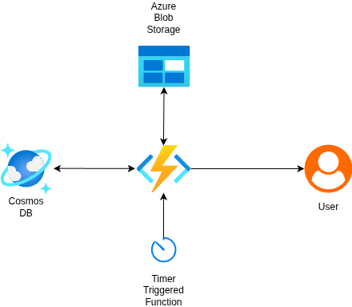

# Azure Cost Optimization Challenge - Architecture Overview

## Goal:
Reduce the cost of storing billing records in Azure Cosmos DB by archiving records older than 3 months to Azure Blob Storage in Cool or Archive tiers, maintaining API compatibility and availability.

## Components:

- **Cosmos DB:** Stores recent billing records (last 3 months).
- **Azure Blob Storage:** Archives older billing records by year/month in JSON blobs.
- **Archival Azure Function:** Timer-triggered daily function which migrates old records from Cosmos DB to Blob Storage, then deletes them from Cosmos DB.
- **Access Layer Azure Function:** Handles all read requests by querying Cosmos DB first; if not found, fetches archived data from Blob Storage transparently to the client.
- **Lifecycle Management:** Blob Storage lifecycle policy moves older blobs to Archive tier automatically.
- **Monitoring & Logging:** Azure Monitor tracks function executions, Cosmos DB & Blob Storage health.
- **Infrastructure as Code:** Bicep script deploys resources reproducibly.

## Architecture Diagram

## Usage

- Deploy infrastructure with Bicep.
- Set environment variables for function apps.
- Deploy Azure Functions.
- Schedule archival function with a Timer Trigger.
- Use the access layer function endpoint for all billing record queries.

## Benefits

- Significant cost savings by tiering storage.
- Zero API breaking changes.
- Automated, reliable archival.
- Easily extensible and maintainable.
